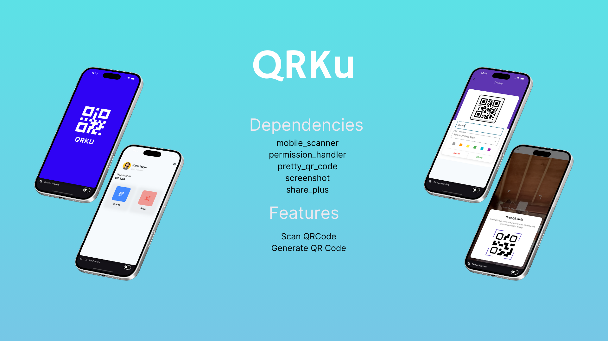

# QRKU

QRKU adalah aplikasi Flutter untuk membuat dan memindai QR Code dengan fitur tambahan seperti berbagi, menyimpan hasil, dan tampilan yang mudah digunakan.

## ✨ Fitur Utama
- **Pindai QR Code** menggunakan kamera.
- **Buat QR Code** dari teks atau tautan.
- **Bagikan hasil QR Code** dengan mudah.
- **Simpan tangkapan layar** dari QR Code yang dibuat.
- Aplikasi cepat dan ringan!

## 🚀 Teknologi yang Digunakan
QRKU dibangun menggunakan Flutter dengan bantuan dependencies berikut:
- [`mobile_scanner`](https://pub.dev/packages/mobile_scanner) - Untuk memindai QR Code.
- [`permission_handler`](https://pub.dev/packages/permission_handler) - Untuk mengelola izin aplikasi.
- [`pretty_qr_code`](https://pub.dev/packages/pretty_qr_code) - Untuk membuat QR Code yang estetis.
- [`screenshot`](https://pub.dev/packages/screenshot) - Untuk menangkap dan menyimpan layar.
- [`share_plus`](https://pub.dev/packages/share_plus) - Untuk berbagi hasil QR Code.

